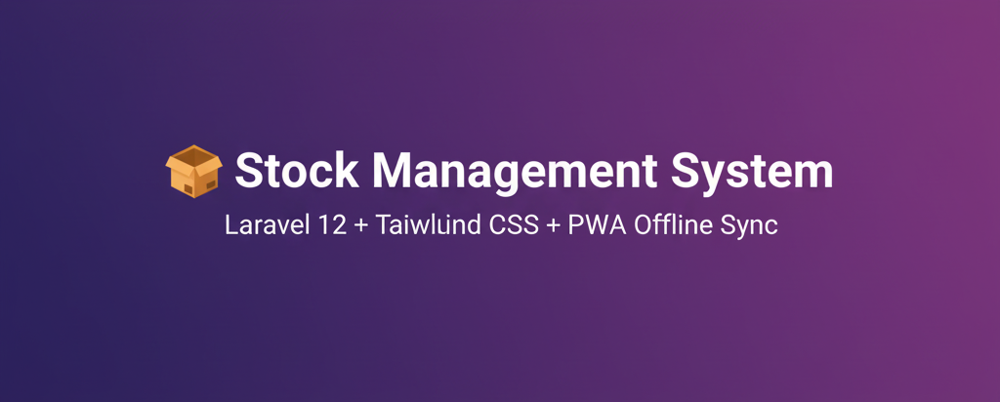

<p align="center">
  
  
  
  
</p>

<h1 align="center">📦 Stock Management System</h1>

<p align="center">
  A modern, role-based <strong>Stock & Finance Management Web App</strong> built with Laravel 12 + Tailwind CSS — featuring offline support, analytics dashboards, and PWA installation.
</p>

---

## 🧭 Table of Contents
- [✨ Features](#-features)
- [🧱 Architecture Overview](#-architecture-overview)
- [📊 Role-Based Dashboards](#-role-based-dashboards)
- [⚡ Offline & PWA Support](#-offline--pwa-support)
- [🧠 Tech Stack](#-tech-stack)
- [🧩 Project Phases](#-project-phases)
- [💾 Installation](#-installation)
- [👑 Default Accounts](#-default-accounts)
- [🚀 Planned Enhancements](#-planned-enhancements)
- [💼 Contributors](#-contributors)

---

## ✨ Features

| Module | Description |
|:--|:--|
| 🧱 **Authentication & Roles** | Secure login via Laravel Breeze with role-based access (Admin, Manager, Cashier) |
| 🧭 **Role Dashboards** | Each role sees unique data: Admin (finance), Manager (overview), Cashier (daily sales) |
| 🛒 **Inventory Control** | Manage categories, products, suppliers, and purchases |
| 💳 **Finance Module** | Track loans, credits, and debits with auto-calculated net balance |
| 📈 **Analytics Reports** | Sales & purchase trends (Chart.js) + downloadable reports |
| ⚡ **PWA (Offline Mode)** | Fully installable on desktop & mobile — works offline |
| 🔁 **Auto Sync System** | Offline sales stored in IndexedDB sync when connection returns |
| 🔔 **Smart Alerts** | Real-time online/offline banner + toast notifications |
| 👩‍💼 **Clean UI** | Responsive sidebar + Lucide icons + Tailwind transitions |

---

## 🧱 Architecture Overview

```text
App/
├── Http/
│   ├── Controllers/
│   │   ├── DashboardController.php
│   │   └── SaleController.php
│   └── Middleware/
│       └── RoleMiddleware.php
├── Models/
│   ├── User.php
│   ├── Sale.php
│   ├── Product.php
│   ├── Loan.php
│   └── DebitCredit.php
resources/
├── views/
│   ├── dashboard/
│   ├── sales/
│   └── layouts/
│       └── app.blade.php
📊 Role-Based Dashboards
| Role          | Dashboard Type                              | Access                            |
| :------------ | :------------------------------------------ | :-------------------------------- |
| 👑 Admin      | Full financial overview, KPIs, reports      | All modules                       |
| 👨‍💼 Manager | Store summary, team performance, charts     | Products, Purchases, Sales, Loans |
| 💵 Cashier    | Daily sales overview, personal transactions | Sales only                        |
⚡ Offline & PWA Support

✅ Progressive Web App (PWA) — installable on phone & desktop
✅ Service Worker — caches essential assets
✅ IndexedDB Storage — saves sales data while offline
✅ Auto Background Sync — pushes data once online
✅ Offline Banner — clear red alert with smooth animation
✅ Toast Notifications — user feedback for sync & network changes

Try It:
1️⃣ Go offline
2️⃣ Record a sale
3️⃣ Reconnect → it syncs automatically 💫
🧠 Tech Stack
| Layer           | Technology                            |
| :-------------- | :------------------------------------ |
| Backend         | Laravel 12 (PHP 8.2)                  |
| Frontend        | Tailwind CSS + Alpine.js              |
| Database        | PostgreSQL                            |
| Authentication  | Laravel Breeze                        |
| Charts          | Chart.js                              |
| Icons           | Lucide Icons                          |
| PWA             | Service Worker + Manifest + IndexedDB |
| Version Control | Git + GitHub                          |
🧩 Project Phases
| Phase | Title                           | Status      |
| :---- | :------------------------------ | :---------- |
| M0    | Authentication + Roles          | ✅ Completed |
| M1    | CRUD Modules                    | ✅ Completed |
| M2    | Dashboards & Charts             | ✅ Completed |
| M3    | PWA + Offline Sync              | ✅ Completed |
| M4    | UI Polish + Mobile Optimization | 🔜 Next     |
💾 Installation
git clone https://github.com/<your-username>/stock-management.git
cd stock-management
composer install
npm install && npm run build
cp .env.example .env
php artisan key:generate
php artisan migrate --seed
php artisan serve
👑 Default Accounts
| Role    | Email                                             | Password |
| :------ | :------------------------------------------------ | :------- |
| Admin   | [admin@example.com](mailto:admin@example.com)     | password |
| Manager | [manager@example.com](mailto:manager@example.com) | password |
| Cashier | [cashier@example.com](mailto:cashier@example.com) | password |

🚀 Planned Enhancements

🌙 Dark mode toggle

🧾 Invoice/Receipt printing

🔔 Stock alerts

📱 Offline-first mobile layout

💬 Manager notes system

📤 Cloud sync logs

💼 Contributors
| Name                     | Role                                    |
| :----------------------- | :-------------------------------------- |
| 🧑‍💻 **Izere Moubarak**    | Lead Developer                          |
| 🤖 **ChatGPT (OpenAI)**  | System Architecture & Technical Support |

<p align="center"> <b>✅ Phase M3 Complete — PWA + Offline Sync Foundation</b><br> <i>Next up: Polish & Mobile Optimization</i> </p> ```

<p align="center">
  
</p>
